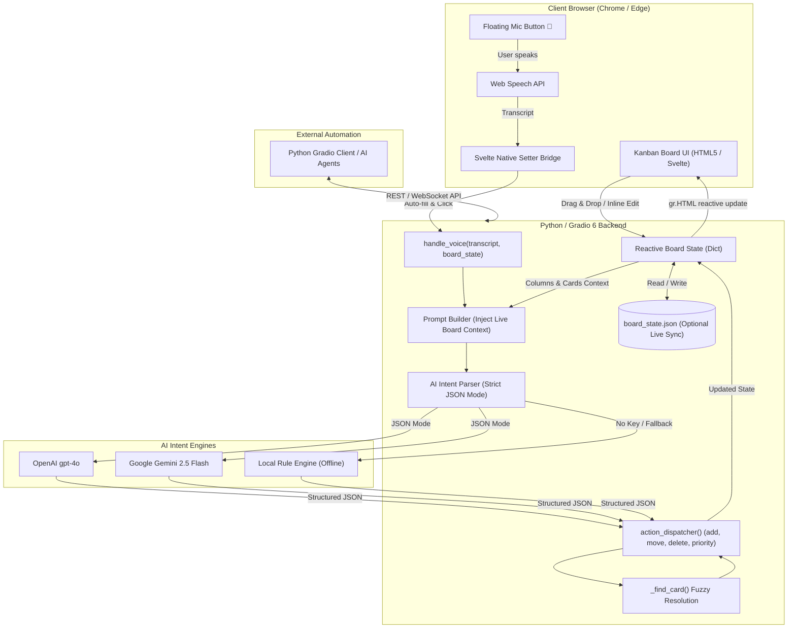

# 🎙️ AI Voice-Controlled Kanban App

[](https://www.python.org/downloads/)
[](https://www.gradio.app/)
[](https://platform.openai.com/)
[](LICENSE)

An interactive, portfolio-grade Agile Kanban Board powered by **real-time browser speech recognition**, **Gradio 6 reactive web components**, and **LLM structured intent parsing** (supporting both **OpenAI GPT-4o** and **Google Gemini 2.5 Flash**).

Speak natural voice commands like *"Add a card called Fix memory leak to In Progress with high priority"* or *"Move login bug to Done"*, and watch the cards update instantly on the board.

---

## 📸 Overview & Features

- **🎙️ Real-Time Voice Commands:** Hands-free interaction via the browser-native W3C Web Speech API (`SpeechRecognition`).
- **🧠 Dual AI Engine:** Supports OpenAI (`gpt-4o`) and Google Gemini (`gemini-2.5-flash` via `google-genai`), plus a built-in offline heuristic rule parser for instant zero-key testing.
- **⚡ Reactive Svelte DOM Bridge:** Leverages Gradio 6 `gr.HTML` custom component model with native prototype setters to instantly pass transcripts into Python.
- **🎯 Intelligent Fuzzy Matching:** Automatically resolves ambiguous verbal references (e.g. *"the login thing"* $\rightarrow$ *"Fix login bug"*) using token-overlap and substring scoring.
- **🎨 Glassmorphic Dark UI:** Modern `#0b0f19` gradient theme, smooth card elevations, priority badges (🔴 High, 🟡 Medium, 🟢 Low), and animated progress indicators.
- **🖱️ Full Direct Interaction:**
  - HTML5 native Drag-and-Drop between columns.
  - Inline card text editing (click to edit, `Enter` or blur to save).
  - Instant card filtering with search query highlighting.
  - Collapsible columns and task counters.
- **🔄 Multi-Client Live Sync:** Includes a headless shared-state backend (`board_state.json`) and an automated Python client (`gradio_client`) for agentic workflows.
- **🔐 JWT Authentication & Cloud Sync:** Secure user registration, salted PBKDF2 password hashing, JWT Bearer tokens, and per-user Kanban board persistence with SQLite and auto-save.

---

## 🏗️ System Architecture



---

## 🗣️ Supported Voice Commands

| Intent | Sample Voice Utterance | Resulting Action |
|---|---|---|
| **Add** | *"Add a card called Deploy to production to Done with high priority"* | Creates card in `Done` column with 🔴 High priority |
| **Add** | *"Create task Update unit tests in To Do"* | Creates card in `To Do` column with 🟡 Medium priority |
| **Move** | *"Move login bug to In Progress"* | Shifts matching card into `In Progress` |
| **Move** | *"Move API timeout to Done"* | Shifts card into `Done` and updates completion percentage |
| **Priority** | *"Set linear algebra priority to high"* | Changes card badge to 🔴 High |
| **Priority** | *"Change documentation priority to low"* | Changes card badge to 🟢 Low |
| **Delete** | *"Delete the card called Market research"* | Removes card from the board |

---

## 🚀 Quick Start Guide

### 1. Clone or Open the Project

```bash
cd "AI Voice-Controlled Kanban App"
```

### 2. Set Up a Python Virtual Environment (Recommended)

```bash
# Windows
python -m venv .venv
.venv\Scripts\activate

# macOS / Linux
python3 -m venv .venv
source .venv/bin/activate
```

### 3. Install Dependencies

```bash
pip install -r requirements.txt
```

### 4. Configure API Keys (Zero-Key Secret Manager or .env)

The app offers **three authentication options**:

#### Option A: Google Cloud Secret Manager (Zero Key Files - Recommended)
If you have a Google Cloud project with Application Default Credentials (`gcloud auth application-default login`), the app **automatically retrieves your Gemini API key from Google Secret Manager** at startup:
- GCP Project: `fir-p1-8dbb8` (or custom `GCP_PROJECT_ID`)
- Secret Name: `gemini-api-key` (or custom `GEMINI_SECRET_NAME`)
- **No `.env` file required!** The key is fetched in-memory and never written to disk.

#### Option B: Local `.env` File
Create a `.env` file in the root folder (or copy `.env.example`):

```bash
cp .env.example .env
```

Edit `.env` and insert either your **OpenAI API Key**, your **Google Gemini API Key**, or both:

```env
OPENAI_API_KEY=sk-proj-...
GEMINI_API_KEY=AIzaSy...
```

#### Option C: Local Rule Engine (Offline)
> 💡 *Note: If run without any API keys or GCP credentials, the built-in Local Rule Engine automatically parses and executes standard voice commands offline!*

---

## 💻 Running the Applications

### Mode A: Interactive Voice-Controlled Board (Main App)

```bash
python kanban_voice.py
```

1. Open the URL displayed in the console (usually `http://127.0.0.1:7860`) in **Google Chrome** or **Microsoft Edge**.
2. Click the floating purple **🎤 button** in the bottom-right corner.
3. Speak your command (e.g. *"Move Research component to In Progress"*).
4. Watch the microphone cycle: 🎤 (Idle) $\rightarrow$ 🔴 (Listening) $\rightarrow$ ⏳ (Processing) $\rightarrow$ Card updates automatically!

---

### Mode B: Live Synchronization & Python Client Automation

Run the shared-state server in **Terminal 1**:

```bash
python kanban_board_with_live_sync.py
```

Run the programmatic automation client in **Terminal 2**:

```bash
python python_gradio_client_for_live_kanban_sync.py
```

Keep your browser open at `http://127.0.0.1:7860` to watch the client clear the board, update the title, insert cards, and transition tasks between columns in real time.

---

### Mode C: Production Serverless Web App (Vercel)

Deploy to Vercel with zero server management:

```bash
# 1. Login to Vercel
vercel login

# 2. Deploy to production
vercel --prod
```

Or run locally with `vercel dev` or using Uvicorn:
```bash
uvicorn api.index:app --reload --port 8000
```

- **Frontend:** Responsive glassmorphic SPA in `public/index.html` with built-in Web Speech API mic button.
- **Backend:** FastAPI serverless handler in `api/index.py` routing AI intent parsing (`/api/command`).

---

## 🔐 Authentication & Security

The application includes a dual-layer authentication system:

### 1. Web App & FastAPI REST Endpoints (JWT + Supabase Cloud PostgreSQL)
- **Password Security:** Salted PBKDF2-HMAC-SHA256 (100,000 iterations) using Python's standard library `hashlib`.
- **Stateless Tokens:** Cryptographically signed HS256 JWT access tokens via `PyJWT`.
- **Dual-Mode Database Storage:**
  - **Supabase Cloud (PostgreSQL with native JSONB):** When `SUPABASE_URL` and `SUPABASE_KEY` are provided, users and board states are persisted to Supabase Cloud PostgreSQL with connection pooling.
  - **Local SQLite Fallback:** When Supabase keys are not present, seamlessly falls back to `kanban_users.db` for 100% offline local testing.
- **API Endpoints:**
  - `POST /api/auth/register` — Create account & initialize user board.
  - `POST /api/auth/login` — Verify credentials & receive JWT token.
  - `GET /api/auth/me` — Verify token & retrieve user profile.
  - `GET /api/user/board` — Load user's saved board.
  - `POST /api/user/board` — Auto-save & sync board changes.
  - `POST /api/command` — Protected voice execution (auto-saves board state for authenticated user).
- **Guest Mode:** Visitors can try the board immediately; signing in enables permanent cloud persistence and multi-device sync.

#### 🐘 Supabase SQL Setup Script
In your Supabase project's **SQL Editor**, execute:
```sql
CREATE TABLE IF NOT EXISTS users (
    id TEXT PRIMARY KEY,
    username TEXT UNIQUE NOT NULL,
    password_hash TEXT NOT NULL,
    salt TEXT NOT NULL,
    created_at TIMESTAMPTZ DEFAULT NOW()
);
CREATE INDEX IF NOT EXISTS idx_users_username_lower ON users (LOWER(username));

CREATE TABLE IF NOT EXISTS user_boards (
    user_id TEXT PRIMARY KEY REFERENCES users(id) ON DELETE CASCADE,
    board_data JSONB NOT NULL,
    updated_at TIMESTAMPTZ DEFAULT NOW()
);
```

### 2. Gradio Application (Basic Auth)
For local or hosted Gradio deployments (`kanban_voice.py`), you can optionally password-protect the interface by specifying environment variables:
```env
GRADIO_AUTH_USER=admin
GRADIO_AUTH_PASSWORD=your_password
```


---

## 📂 Project Structure

```
AI Voice-Controlled Kanban App/
├── api/
│   ├── index.py                                  # Vercel FastAPI serverless endpoint (/api/command, auth)
│   └── requirements.txt                          # Serverless-specific slim dependencies
├── public/
│   └── index.html                                # Standalone glassmorphic SPA frontend
├── auth.py                                       # Password hashing, JWT lifecycle & SQLite user storage
├── index.html                                    # Root web frontend with Auth modal & live cloud sync
├── kanban_voice.py                               # Full interactive Gradio 6 application (with optional auth)
├── kanban_actions.py                             # Pure Python state mutations & fuzzy matcher
├── ai_service.py                                 # Intent parsing service (Gemini + Secret Manager + OpenAI)
├── kanban_board_with_live_sync.py                # Shared state live-sync server with API endpoints
├── python_gradio_client_for_live_kanban_sync.py  # Automation script using gradio_client
├── test_app.py                                   # Intent parsing & fuzzy matching tests (9/9 passing)
├── test_auth.py                                  # Auth unit & integration test suite (7/7 passing)
├── vercel.json                                   # Vercel serverless function & routing configuration
├── requirements.txt                              # Complete project dependencies
├── .env.example                                  # API keys & auth configuration template
├── .gitignore                                    # Excludes virtual environments and state files
└── README.md                                     # Complete technical documentation
```


---

## 🛠️ Troubleshooting

| Issue | Solution |
|---|---|
| **Mic button is grey / inactive** | Switch to **Google Chrome**, **Microsoft Edge**, or **Brave**. Mozilla Firefox does not support the Web Speech API. |
| **Microphone not capturing audio** | Ensure microphone permissions are allowed for `127.0.0.1` / `localhost` in browser settings. |
| **"Could not find card matching..."** | The card fuzzy match scored below threshold. Speak the card title more clearly or use a unique keyword from its title. |
| **API Error in Status Bar** | Verify your `.env` contains a valid `OPENAI_API_KEY` or `GEMINI_API_KEY`. You can also switch the dropdown to **Local Rule Engine** for zero-API execution. |

---

## 📜 License

MIT License — free for learning, building, and portfolio showcase.
